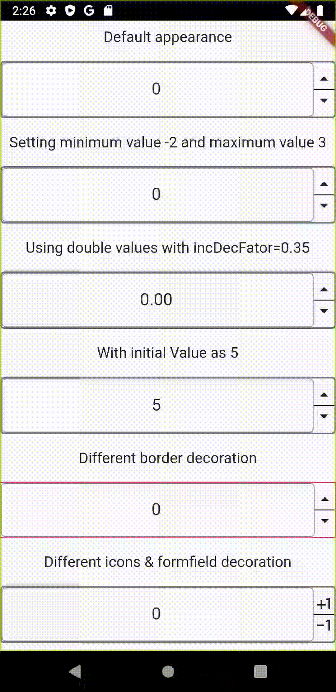

# Example

.

## Demo

Simple demo with different options being used for this widget.

```dart
import 'package:flutter/material.dart';
import 'package:number_inc_dec/number_inc_dec.dart';

void main() {
  runApp(MyApp());
}

class MyApp extends StatelessWidget {
  @override
  Widget build(BuildContext context) {
    return MaterialApp(
      title: 'Flutter Demo',
      theme: ThemeData(
        primarySwatch: Colors.blue,
        visualDensity: VisualDensity.adaptivePlatformDensity,
        textTheme: Theme.of(context).textTheme.apply(
              fontSizeFactor: 1.1,
              fontSizeDelta: 2.0,
            ),
      ),
      home: SafeArea(
        child: Scaffold(
          body: Center(
            child: Column(
              mainAxisAlignment: MainAxisAlignment.spaceAround,
              children: [
                Text('Default appearance'),
                NumberInputWithIncrementDecrement(
                  controller: TextEditingController(),
                ),
                Text('Setting minimum value -2 and maximum value 3'),
                NumberInputWithIncrementDecrement(
                  controller: TextEditingController(),
                  min: -3,
                  max: 3,
                ),
                Text('Using double values with incDecFator=0.35'),
                NumberInputWithIncrementDecrement(
                  controller: TextEditingController(),
                  isInt: false,
                  incDecFactor: 0.35,
                ),
                Text('With initial Value as 5'),
                NumberInputWithIncrementDecrement(
                  controller: TextEditingController(),
                  initialValue: 5,
                ),
                Text('Different border decoration'),
                NumberInputWithIncrementDecrement(
                  controller: TextEditingController(),
                  widgetContainerDecoration: BoxDecoration(
                    border: Border.all(
                      color: Colors.pink,
                    ),
                  ),
                ),
                Text('Different icons & formfield decoration'),
                NumberInputWithIncrementDecrement(
                  controller: TextEditingController(),
                  numberFieldDecoration: InputDecoration(
                    focusedBorder: OutlineInputBorder(
                      borderRadius: BorderRadius.circular(5.0),
                      borderSide: BorderSide(color: Colors.orange, width: 2.0),
                    ),
                    border: OutlineInputBorder(
                      borderRadius: BorderRadius.circular(5.0),
                    ),
                  ),
                  incIcon: Icons.plus_one,
                  decIcon: Icons.exposure_neg_1,
                ),
              ],
            ),
          ),
        ),
      ),
    );
  }
}
```


